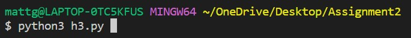

# CS 580 - Assignment 2

Matthew Guilloty - 02/23/2023

## How To Run the Heuristic Functions:

The zip file should contain the following contents:

To be able to run any of the programs, you must have a [Python 3.10](https://www.python.org/) interpreter or newer and the [NumPy](https://numpy.org/) library installed.

`game.py` comtains all of the functions needed to play the slide puzzle game.

`h1.py`, `h2.py`, `h3.py`, and `h4.py` contain the heuristic functions within BFS and DFS algorithms to solve the puzzle. They all have similar structures.

The `sampleOutput` folder contains each solution for the rubric's initial state and goal state.

The `images` folder contains all of the screenshots used for this `.md` file.

To make changes to the initial and goal states, you only need to make changes in `game.py` at the top of the file:

The template for the states is the following:

To run the informed search algorithms, open up a terminal in the same folder the files are in and type:

or

or

or

There will be output coming out of the terminal throughout the session. It will look something like this:

Depending on which heuristic function is being run, you will see the following after each neighbor is created:

 - *Number of Incorrect Pieces:*
 - *Manhattan Distance:*
 - *Total Number of Incorrect Adjacent Pairs:*
 - *h1 + h2 =*

Once the solution is found, a .txt file will be filled in your directory. It will look like any of the following depending on which Python file is run:

Each .txt file will have a path from the initial state to the goal state. Along with this, the first few lines will have a few analytics as well:

## Analysis Report

`h1.py`, `h3.py`, and `h4.py` are variations of the BFS algorithm and `h2.py` is a variation of the DFS algorithm. 

The following are the results from each method implemented:

# h1(x)

# h2(x)

# h3(x)

# h4(x)

It looks like certain heuristic functions had their advantages:

- **h4(x)** had the shortest path to the solution ( Only 364 moves )
- **h1(x)** was able to find the solution in the quickest amount of time ( Only 0.44 minutes! )
- **h1(x)** used the fewest number of iterations to reach the goal ( 8,227 iterations )

It looks like **h2(x)** was the worst performing heuristic out of the four.

If we did not care about path length, our best heuristic would be **h1(x)**. 

If path length was the most important aspect to solving the puzzle, then **h4(x)** would be the best heuristic.